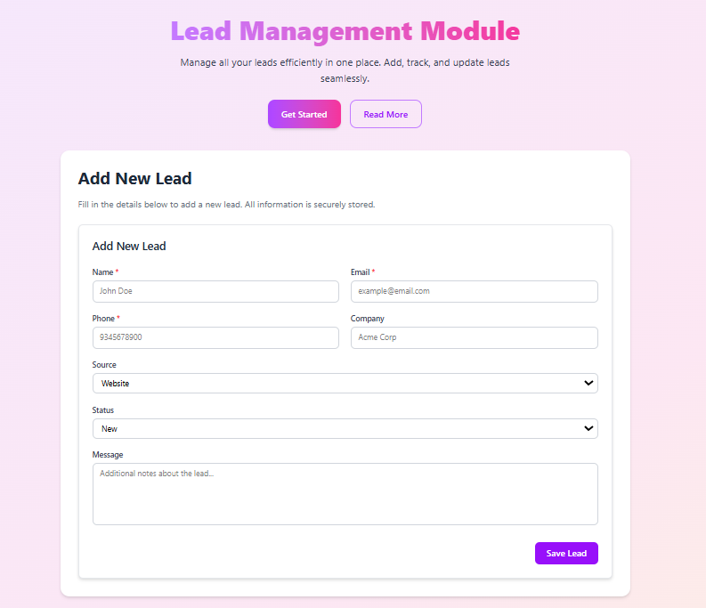
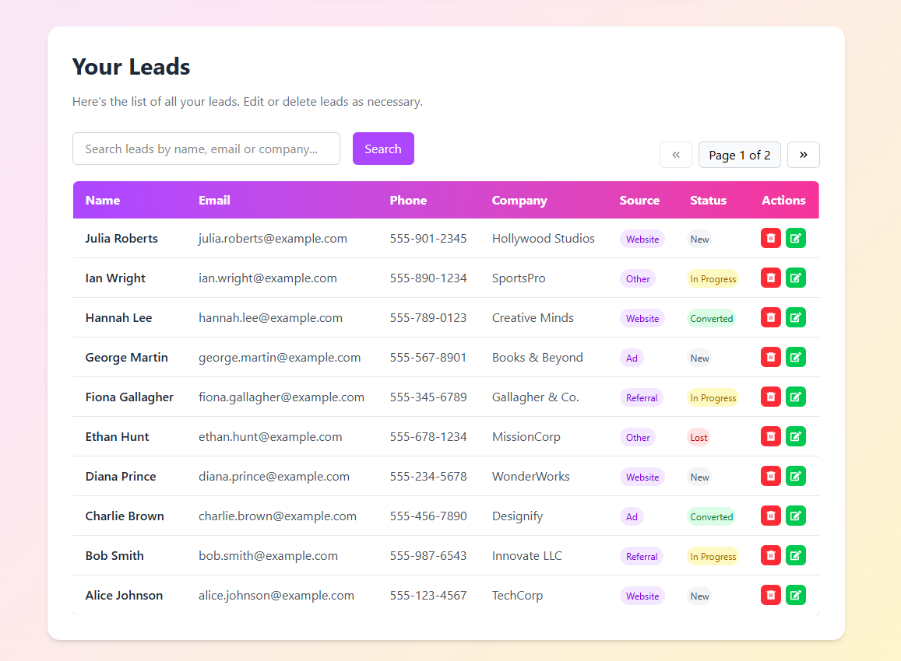
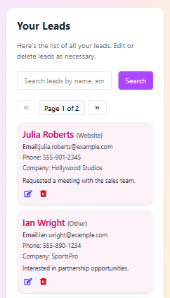

# Lead Management Module

**Live Link** 
https://lead-management-module-eta.vercel.app/

A full-featured **Lead Management Module** built with **React** (frontend) and **Node.js + Express + MongoDB** (backend). This module allows you to **add, edit, delete, search, and paginate leads** efficiently. It is fully responsive for **desktop and mobile devices**.

---

## Features

- **Add Leads**: Capture lead information like name, email, phone, company, source, status, and message.  
- **Edit & Delete Leads**: Update or remove leads as needed.  
- **Search Leads**: Search leads by name, email, or company.  
- **Pagination**: Supports server-side pagination for faster data loading.  
- **Responsive UI**: Optimized for both desktop tables and mobile cards.  
- **Field Validation**: Validates input fields like email and phone formats.  
- **Loading Indicators**: Displays a spinner while fetching data.  

---

## 🛠️ Tech Stack

- **Frontend**: React, TailwindCSS, React Icons, react-hot-toast  
- **Backend**: Node.js, Express.js, MongoDB, Mongoose  
- **API**: RESTful endpoints for CRUD and search   

---

## 🚀 Project Setup

```bash
  # Clone the repository
   git clone https://github.com/Mansi-prasad/Lead-Management-Module

   # Navigate to the project folder
   cd Lead-Management-Module

   # Set up environment variables .env file for both frontend and backend

   # Install dependency for backend
   cd backend
   npm install
   # Run the development server
   npm run server

   # Install dependency for frontend
   cd frontend
   npm install
   # Run the development server
   npm run dev

  # open in browser
  http://localhost:5173/

```
---

##  Database Schema
The `Lead` model has the following structure:

```json
{
  "_id": "ObjectId",
  "name": "John Doe",
  "email": "john.doe@example.com",
  "phone": "+1234567890",
  "company": "Example Corp",
  "source": "Website", // Enum: Website, Referral, Ad, Other
  "status": "New",     // Enum: New, In Progress, Converted, Lost
  "message": "Interested in our services",
  "createdAt": "2025-09-30T10:00:00Z",
  "updatedAt": "2025-09-30T10:00:00Z"
}
```
---

## 📚 API Description
The API provides endpoints for managing leads: 
* Create Lead – Add a new lead with validations `POST /api/leads`.
* Get Leads – Fetch all leads with pagination `GET /api/leads?page=1&limit=10`. 
* Update Lead – Update a lead by ID `PUT /api/leads/:id`.
* Delete Lead – Delete a lead by ID `DELETE /api/leads/:id`.
* Search Leads – Search leads by name, email, phone, or company with pagination `GET /api/leads/search?query=jane&page=1&limit=10`.

---


## 📸 Screenshots

**Lead Form page:** 



**Lead Desktop View:**



**Lead Mobile View:**


